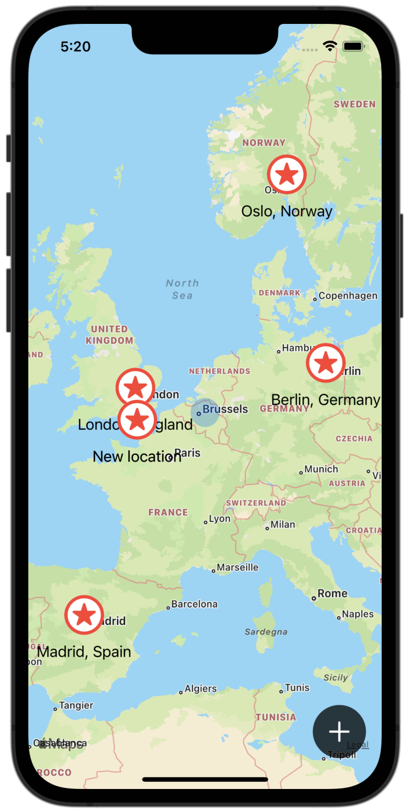
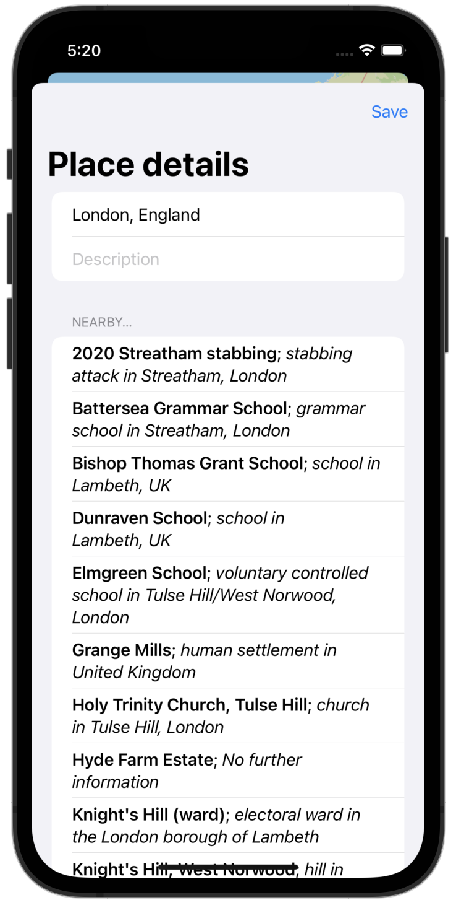
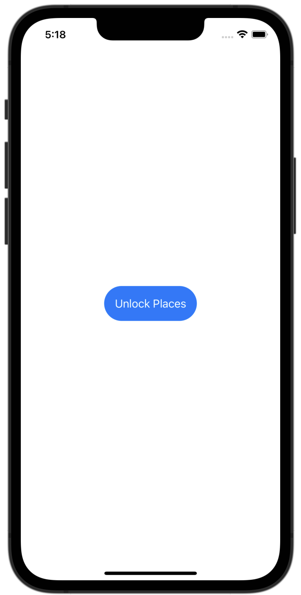
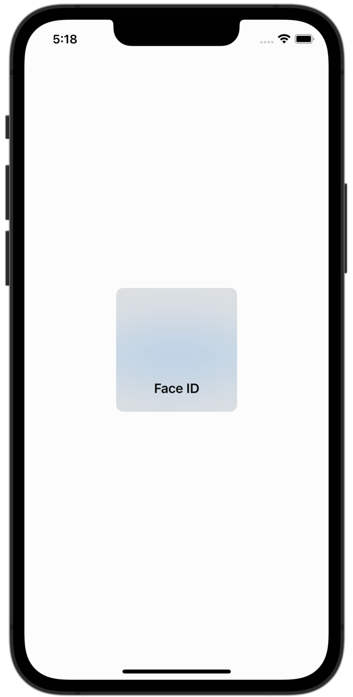

# BucketList

A simple iOS app, built with SwiftUI, that lets people save a private list of locations on a map that they would like to visit someday, along with descriptions and interesting places nearby.

## Installing / Getting started

To run this project, you will need a Mac computer with the latest version of Xcode and an iOS 15 Simulator set up. Simply clone the respository, open the project in Xcode, and run the app to get it working.

## Features

* Explorable map experience
* Add custom marked locations with names and descriptions
* Edit saved locations
* Saved data encryption behind Face ID or Touch ID

## Credit

The idea for this project came from Paul Hudson's *100 Days of SwiftUI*. I may eventually add to this code, but credit for the base code goes to Paul Hudson. Links to each day on which material is referenced may be found below:

[Day 68 - BucketList Part One](https://www.hackingwithswift.com/100/swiftui/68)

[Day 69 - BucketList Part Two](https://www.hackingwithswift.com/100/swiftui/69)

[Day 70 - BucketList Part Three](https://www.hackingwithswift.com/100/swiftui/70)

[Day 71 - BucketList Part Four](https://www.hackingwithswift.com/100/swiftui/71)

[Day 72 - BucketList Part Five](https://www.hackingwithswift.com/100/swiftui/72)

[Day 73 - BucketList Part Six](https://www.hackingwithswift.com/100/swiftui/73)

## Screenshots

    
    
    
    

